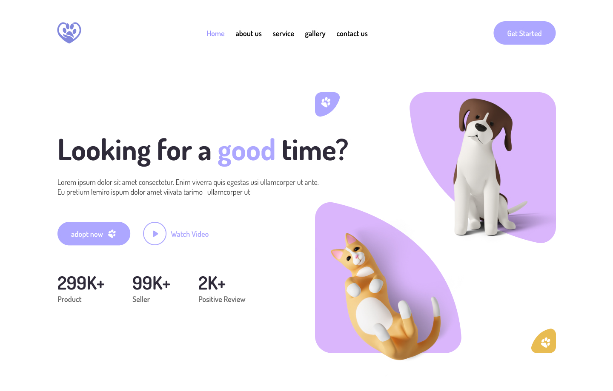
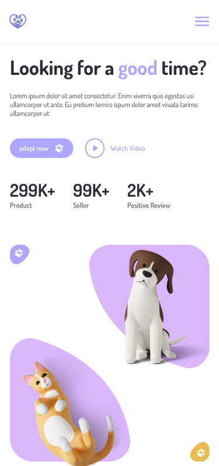

# Hometask Pet Adoption Landing Page

## Task descrition

You task is to implement Figma design. The main goal is to implement it close to design, not pixel-perfect.

Please be flexible and do not stick completly to design in these cases:

- Font used in Figma is a paid or not available on the internet - try to replace it with a font you would like to. The best practice is just to used standard fonts like Roboto
- Figma elements' dimenstion specified in:
  - real numbers (44.21) --> round to closest odd number (46 or 44)
  - even number (11, 67) --> round to closes odd number or to the closes pow of 2 (12, 64)
  - visually margins left and right are equal to each other, but in numbers they are i.e 51 and 49. Choose one value, better odd number (24, 12, etc)

## Evaluation criteria - HR Students

Maximum score - 10 consists of:

- "Desktop" layout implementation (Hero Section block in Figma) (desktop view should be applied on 769px and above):
  - [ ] Header section with logo, navbar (home, about us, etc) and a button - 0.5
  - [ ] Main section with text content and images - 2.5
- "Mobile" layout implementation (Mobile Responsive block in Figma) (mobile view should be applied on 768px and less):
  - [ ] Header section with logo and a burger menu icon (just icon, without any logic) - 0.5
  - [ ] Main section with text content and images - 2.5

Common techniques for both layouts:

- Connect and use font [Lato](https://fonts.google.com/specimen/Lato) - 0.25
- Connect and use [normalize css](https://cdnjs.com/libraries/normalize) - 0.25
- Use [BEM](https://en.bem.info/methodology/) - 1
- [Mobile-first design approach](https://www.freecodecamp.org/news/taking-the-right-approach-to-responsive-web-design/) - 1.5
- On a screen with any height either desktop or mobile layout should be visible fully without vertical scrolling - 1

## Evaluation criteria - LR Students

Maximum score - 10 consists of:

- "Desktop" layout implementation (Hero Section block in Figma) (desktop view should be applied on 769px and above):
  - [ ] Header section with logo, navbar (home, about us, etc) and a button - 0.5
  - [ ] Main section with text content and images - 2.5
- "Mobile" layout implementation (Mobile Responsive block in Figma) (mobile view should be applied on 768px and less):
  - [ ] Header section with logo and a burger menu icon (just icon, without any logic) - 0.5
  - [ ] Main section with text content and images - 2.5

Common techniques for both layouts:

- Connect and use font [Lato](https://fonts.google.com/specimen/Lato) - 0.5
- Connect and use [normalize css](https://cdnjs.com/libraries/normalize) - 0.5
- [Mobile-first design approach](https://www.freecodecamp.org/news/taking-the-right-approach-to-responsive-web-design/) - 2
- On a screen with any height either desktop or mobile layout should be visible fully without vertical scrolling - 1

## Figma design link

[Figma design link is here](<https://www.figma.com/file/DFKBdnuR3osZ7VM5Jb9Go3/Pet-Adoption-Website-Modified-(Landing-Page)-(Community)>)

## Image design

Click to display final design (desktop)

Click to display final design (mobile)

## Project structure

`index.html` - contains HTML code

`assets/design` - contains final design template

`assets/images` - contains images

`assets/icons` - contains icons

`styles` - contains CSS code

## How to run

### Running by simply opening index.html in browser

- Open file `index.html` on browser
  - In Visual Studio Code right click in index.html -> Copy Path
  - Open browser and paste copied path as an url (i.e `D://Proejcts/intro-to-web-dev-tasks/packages/classtask-YuliaVorman/index.html`)
- Enjoy

Why not to use that approach - every time you're making changes you have to reload your page manually

Why to use - simply you don't want to deal with NPM and JavaScript or there might be any issues currently with it

### Running using NPM and JavaScript (Preferred)

- Open console
- In console navigate to the project root (`./intro-to-web-dev-tasks`)
- Run `npm install`
- Navigate to the project `cd packages/classtask-YuliaVorman`
- Run `npm run serve`
- Open browser
- Navigate to `http://localhost:8080/`
- Enjoy

Why to use - every time you make a change your page is automatically reloaded and your changes applied

Why not to use - you don't want to deal with NPM and JavaScript or there might be any issues currently with it
